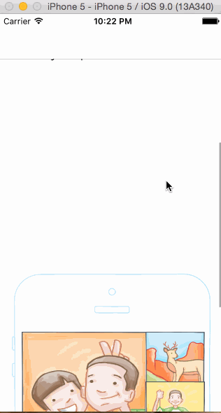

# Carousel App for Codepath

This application is an exercise to complete the carousel application to Codepath's iOS for Designers course's Week2 Assignment 

Time spent: 25 hours

## What does the app can do?

This is an implementation of the Swift carousel app by following Week2 assignment exercises and courses by CodePath.

* [x] Required: Static photo tiles on the initial screen
* [x] Required: Tapping on email/password reveals the keyboard and shifts the scrollview and Sign In button up.
* [x] Required: Upon tapping the Sign In button: If the username or password fields are empty, user sees an error alert,
* [x] Required: Upon tapping the Sign In button: If credentials are incorrect, user sees an error alert.
* [x] Required: If the credentials are correct, user sees a transition to the Tutorial screens.
* [x] Required: Tutorial Screens: User can page between the screens
* [x] Required: Image Timeline: Display a scrollable view of images.
* [x] Required: Image Timeline: User can tap on the profile image to see the settings view (modal from below).
* [x] Required: Image Timeline: User can tap on the conversations button to see the conversations screen (push).
* [x] Required: Conversations: User can dismiss the conversations screen
* [x] Required: Settings: User can dismiss the settings screen.
* [x] Required: Settings: User can log out

## What's different/open issues
- Error while using push navigation to conversations button to see the conversations screen (push)

## Credit
GIF created with [LICEcap](http://www.cockos.com/licecap/).
